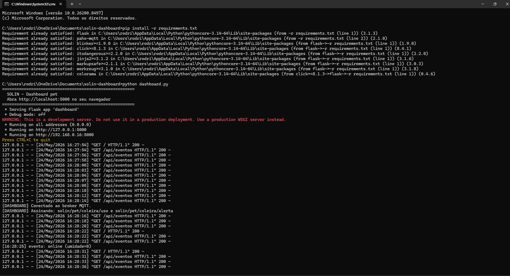
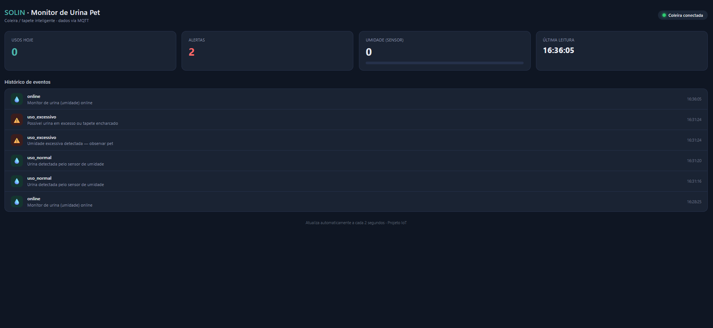
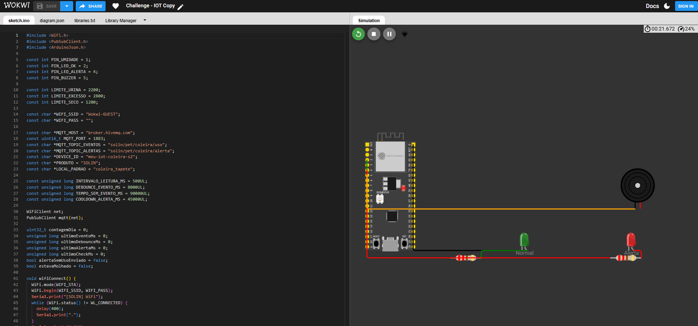
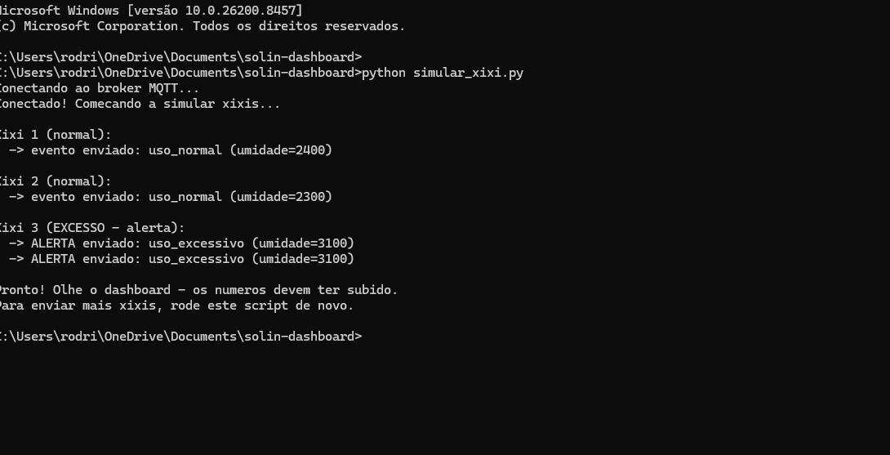

# SOLIN — Coleira/Tapete Inteligente para Pets (Projeto IoT)

## Integrantes do grupo

| Nome | RM |
|---|---|
| Rodrigo Silva | 565162 |
| Nickolas Davi | 564105 |
| Samara Vilela | 566133 |
| Natália Cristina | 564099 |
| Otávio Ferreira | 565960 |

## Links do projeto

- Simulação no Wokwi: https://wokwi.com/projects/464927683816800257
- Repositório: https://github.com/Rcsilva05/solin-iot

---

Sistema IoT que detecta quando o pet faz xixi (no tapete ou coleira) usando um
sensor de umidade, aciona avisos locais (LED + buzzer) e envia os eventos pela
internet via MQTT para um **dashboard web em tempo real**.

## O problema que o projeto resolve

Tutores nem sempre conseguem acompanhar a rotina urinária do pet, principalmente
quando passam o dia fora. Mudanças nessa rotina (urinar demais, de menos, ou
parar de urinar) podem indicar problemas de saúde. O SOLIN monitora isso
automaticamente e avisa o tutor em tempo real.

## Arquitetura

```
  ESP32 + sensor de umidade        Broker MQTT              Dashboard (Python)
  (firmware em C++/Arduino)   -->  broker.hivemq.com  -->   Flask + página web
       detecta o xixi              (intermediário)          mostra os dados
       acende LED / buzzer                                  em tempo real
       publica via MQTT
```

- **Sensor → ESP32 (C++):** detecta a umidade. Acima de um limite = xixi detectado.
- **MQTT:** protocolo leve de mensagens. O ESP32 *publica* eventos; o dashboard *assina* e recebe.
- **Dashboard (Python):** recebe os eventos e exibe contadores, alertas e histórico.

Circuito montado na simulação do Wokwi (ESP32 + sensor + LEDs + buzzer):



## Frameworks e ferramentas usados

| Ferramenta | Onde | Para quê |
|---|---|---|
| **Arduino / ESP32** | Firmware (C++) | Roda no microcontrolador, lê o sensor |
| **PubSubClient** | Firmware | Cliente MQTT no ESP32 |
| **ArduinoJson** | Firmware | Monta as mensagens em formato JSON |
| **MQTT (HiveMQ)** | Comunicação | Transporte dos eventos pela rede |
| **paho-mqtt** | Dashboard (Python) | Recebe as mensagens MQTT |
| **Flask** | Dashboard (Python) | Servidor web que entrega a página |
| **Wokwi** | Simulação | Simula o circuito sem hardware físico |

## Tópicos MQTT

| Tópico | Conteúdo |
|---|---|
| `solin/pet/coleira/uso` | Eventos de uso (xixi detectado, online, etc.) |
| `solin/pet/coleira/alerta` | Alertas (excesso de umidade, muito tempo sem uso) |

Cada mensagem é um JSON, por exemplo:

```json
{
  "produto": "SOLIN",
  "tipo": "uso_normal",
  "mensagem": "Urina detectada pelo sensor",
  "alerta": false,
  "umidade_raw": 2400,
  "contagem_dia": 1
}
```

## Como rodar o projeto (passo a passo)

### Pré-requisito
Ter o **Python** instalado (https://python.org — na instalação, marque a caixa
"Add Python to PATH").

### 1. Iniciar o dashboard
Abra a pasta do projeto, clique na barra de endereço lá em cima, digite `cmd` e
dá Enter — isso abre o terminal já dentro da pasta certa. Aí roda esses dois
comandos, um de cada vez:

```
pip install -r requirements.txt
python dashboard.py
```

Depois é só deixar essa janela aberta (ela tem que ficar rodando) e abrir o
navegador em **http://localhost:5000**.

Quando o dashboard está rodando, o terminal mostra a conexão com o broker MQTT e
as atualizações chegando:



> O dashboard começa zerado, mostrando "Aguardando coleira...". Isso é normal —
> ele está esperando os dados chegarem.

### 2. Enviar os dados (duas opções)

**Opção A — pela simulação no Wokwi (a coleira "de verdade"):**
1. Abra o link do Wokwi e clique no botão verde de play.
2. Localize o sensor de umidade (rótulo "Umidade (urina)").
3. Passe o mouse sobre o sensor e arraste a barrinha de controle para um valor
   alto (acima de 2200 = xixi; acima de 2800 = alerta de excesso).
4. Os eventos aparecem automaticamente no dashboard.

**Opção B — pelo simulador em Python (para demonstração):**
Às vezes mexer no sensor dentro do Wokwi é meio chato, então criamos um
programinha que faz o papel da coleira e manda os xixis automaticamente. É bem
fácil: deixe o `dashboard.py` rodando na janela que já estava aberta, e abra uma
SEGUNDA janela do terminal — mesmo processo de antes: entra na pasta do projeto,
clica na barra de endereço, digita `cmd` e dá Enter. Aí, nessa janela nova, é só
colar:

```
python simular_xixi.py
```

Ele vai mandar 3 xixis de teste (2 normais e 1 de alerta), e você vê os números
subindo na hora lá no dashboard. Se quiser mandar mais xixis depois, é só rodar
esse mesmo comando de novo.



E o resultado aparece no dashboard, com os contadores e o histórico de eventos
atualizados em tempo real:



## Limites de detecção (definidos no firmware)

| Faixa de umidade (0 a 4095) | Significado |
|---|---|
| abaixo de 1200 | seco — nada acontece |
| acima de 2200 | xixi detectado (LED verde + 1 bipe) |
| acima de 2800 | excesso (LED vermelho + 4 bipes + alerta) |

Há um intervalo (debounce) de 8 segundos entre um evento e outro para evitar
contagens repetidas da mesma urina.

## Resolução de problemas

**Cliquei no play no Wokwi mas nada aparece no dashboard.**
- Verifique se o `dashboard.py` está rodando e se o navegador mostra "Coleira
  conectada".
- O evento "online" no histórico apenas indica que o ESP32 ligou; ele não conta
  como xixi. Para os contadores subirem é preciso simular umidade (arrastar o
  sensor no Wokwi, ou rodar o `simular_xixi.py`).
- Respeite o intervalo de 8 segundos entre eventos.

**O navegador mostra "Não é possível acessar esse site / conexão recusada".**
- Significa que o `dashboard.py` não está mais rodando. Rode `python dashboard.py`
  de novo e recarregue a página.

**Os contadores voltaram a zero.**
- Toda vez que o `dashboard.py` é reiniciado, a contagem recomeça do zero. Basta
  enviar novos eventos para preenchê-la novamente.

**O `http://localhost:5000` não abre no computador de outra pessoa.**
- `localhost` se refere apenas ao computador onde o programa está rodando. Para
  ver o dashboard, é preciso rodar o `dashboard.py` na própria máquina.

## Estrutura do projeto

```
solin-dashboard/
├── dashboard.py          # servidor Python (MQTT + web)
├── simular_xixi.py       # simulador da coleira (para demonstração)
├── requirements.txt      # dependências
├── templates/
│   └── index.html        # página do dashboard
├── simulador-imagens/    # prints do projeto usados no README
├── sketch.ino            # firmware do ESP32 (C++) — feito no Wokwi
└── README.md             # este arquivo
```

## Justificativa técnica: por que sensor de umidade?

A detecção é feita por **umidade**, não por temperatura. A urina esfria muito
rápido ao contato com o tapete e a diferença de temperatura desaparece em
segundos, o que tornaria a detecção por temperatura pouco confiável. A umidade
permanece detectável por mais tempo, sendo a escolha de engenharia mais robusta
para este caso.
